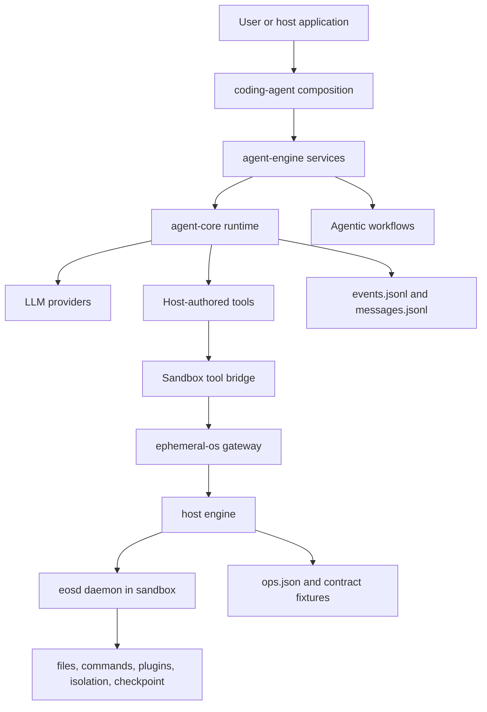

# Ephemeral AI

Ephemeral AI is a composed research and engineering workspace for building
agentic coding systems on top of disposable, policy-controlled execution
environments.

The repository is intentionally small at the root. It pins two independently
developed submodules:

| Submodule | Role |
| --- | --- |
| [`ephemeral-agent`](./ephemeral-agent) | TypeScript agent runtime, host services, coding-agent composition, typed tools, workflow orchestration, hooks, LLM client adapters, and JSONL run records. |
| [`ephemeral-os`](./ephemeral-os) | Rust sandbox substrate with a gateway, host engine, in-container daemon, command/file/plugin operations, layer stacks, isolated workspaces, and contract fixtures. |

Together they form the two halves of the system: an agent layer that decides
what to do, and a sandbox layer that makes execution observable, bounded, and
recoverable.

## Why This Exists

Modern coding agents need more than prompt orchestration. They need a runtime
that can:

- execute typed tools without smuggling product policy into the SDK;
- run long-lived workflows with durable event and message records;
- isolate command execution and file mutation behind a reviewed operation
  catalog;
- recover from sandbox daemon failures without replaying ambiguous writes;
- keep host-side fleet control separate from in-container work execution;
- make tests deterministic at the agent layer and contract-driven at the
  sandbox layer.

Ephemeral AI is the integration workspace for those concerns.

## System Shape



The important boundary is deliberate:

- `ephemeral-agent` owns agent mechanics, workflows, model-visible tools, LLM
  wire adapters, hooks, and run records.
- `ephemeral-os` owns sandbox lifecycle, routing, daemon execution, operation
  contracts, layer storage, command IO, and isolation.
- The root repository owns composition, submodule pinning, shared collateral,
  and contributor orientation.

## Repository Layout

```text
.
|-- README.md
|-- .gitmodules
|-- assets/
|   `-- website/              Static website/report collateral.
|-- code-inventory/           Local generated inventory output, ignored by git.
|-- ephemeral-agent/          TypeScript agent workspace submodule.
`-- ephemeral-os/             Rust sandbox workspace submodule.
```

### `ephemeral-agent`

The agent workspace is a private pnpm monorepo:

| Package | Responsibility |
| --- | --- |
| `@ephai/agent-core` | Mechanism-only SDK for provider turns, tool batches, hooks, background tasks, notifications, typed terminal outcomes, and JSONL run records. |
| `@ephai/agent-engine` | Reusable host services: agent factories, workflow factories, run stores, advisory helpers, and model-visible tool implementations. |
| `@ephai/coding-agent` | Product composition root: `.ephai` config loading, sandbox tools, hook commands, agent profiles, workflow modules, and operator bootstrap. |

The SDK is intentionally mechanism-only. Product tools, prompts, gates,
workflow definitions, and subprocess behavior enter from the host layer rather
than from `agent-core`.

### `ephemeral-os`

The sandbox workspace is a Rust project with a host/box split:

| Component | Responsibility |
| --- | --- |
| `gateway` | Single external Unix socket, catalog-based visibility checks, routing, and response return. |
| `host` | Sandbox fleet ownership, Docker runtime integration, daemon recovery, and host-side protocol client. |
| `eosd` / `daemon` | In-container operation dispatcher and executor for files, commands, plugins, isolation, and checkpoint support. |
| `crates/operation/ops.json` | Reviewed static operation catalog shared across the boundary. |
| `contract/` | Protocol prose and golden fixtures used as conformance ground truth. |

No compiled code is shared across the host/box boundary. The shared artifacts
are the operation catalog and contract fixtures.

## Quick Start

Clone with submodules:

```bash
git clone --recurse-submodules https://github.com/YifanXu1999/ephemeral-ai.git
cd ephemeral-ai
```

If the repository was cloned without submodules:

```bash
git submodule update --init --recursive
```

Check pinned submodule state:

```bash
git submodule status --recursive
```

## Development Environment

Install the toolchains required by the submodules:

| Area | Requirement |
| --- | --- |
| Agent workspace | Node.js with modern ESM support and `pnpm@10.23.0` through Corepack or a local pnpm install. |
| Sandbox workspace | Rust toolchain pinned by `ephemeral-os/rust-toolchain.toml`. The workspace package metadata currently targets Rust `1.85`. |
| Live sandbox tests | Docker, Linux container support, and enough local resources for concurrent sandbox containers. |
| Gateway smoke tests | `socat` or an equivalent Unix-socket client is useful for manual probes. |

## Common Commands

Agent workspace:

```bash
cd ephemeral-agent
pnpm install
pnpm run typecheck
pnpm run lint
pnpm run test
pnpm run check
```

Package-scoped agent checks:

```bash
pnpm --filter @ephai/agent-core run check
pnpm --filter @ephai/agent-engine run check
pnpm --filter @ephai/coding-agent run check
```

Live provider tests are intentionally separate and require credentials:

```bash
pnpm --filter @ephai/agent-core run test:e2e
```

Sandbox workspace:

```bash
cd ephemeral-os
cargo run -p xtask -- check-contract
cargo test --workspace
cargo run -p xtask -- gen-docs
cargo run -p xtask -- package
```

Live Docker-backed sandbox suite:

```bash
cargo run -p e2e-test --bin e2e-runner -- \
  --max-parallel 5 \
  --container-weight-cap 10 \
  --heavy-test-threads 4
```

Serve the sandbox gateway:

```bash
cargo run -p gateway -- serve \
  --listen /tmp/eos-sandbox.sock \
  --image <docker-image> \
  --platform linux/amd64
```

Probe the operator socket:

```bash
printf '%s\n' '{"op":"sandbox.checkpoint.layer_metrics","sandbox_id":"<sb-id>","invocation_id":"probe-1","args":{"layer_stack_root":"/eos/layer-stack"}}' \
  | socat - UNIX-CONNECT:/tmp/eos-sandbox.sock.operator
```

## Configuration Model

The checked-in coding-agent host configuration lives under:

```text
ephemeral-agent/packages/coding-agent/.ephai/
|-- agents/
|-- agentic-workflows/
|-- hooks/
|-- llm-clients/
`-- runs/
```

This directory is the product composition surface. It defines agent profiles,
workflow modules, hook commands, LLM client profiles, and local run storage.

Before running live provider calls in a new environment, review the selected LLM
client profile and credential source in `.ephai/llm-clients/llm-clients.json`.

## Contracts And Drift Gates

The sandbox contract is intentionally treated as product surface:

- `ephemeral-os/crates/operation/ops.json` is the canonical operation catalog.
- `ephemeral-os/contract/` contains protocol fixtures and prose used for
  conformance.
- `ephemeral-os/docs/API.md` is generated from the catalog.
- `cargo run -p xtask -- check-contract` is the main drift gate.

When editing sandbox operations, update code, regenerate generated docs where
needed, and run the contract gate before relying on the behavior.

## Working With Submodules

This root repository records exact submodule commits. Work inside a submodule is
normal Git work and must be committed or pushed in that submodule before the
root repository can record the new pointer.

Typical update flow:

```bash
cd ephemeral-agent
git status
git add <files>
git commit -m "Describe agent change"
git push

cd ../
git add ephemeral-agent
git commit -m "Update ephemeral-agent submodule"
```

Use the same flow for `ephemeral-os`.

To move both submodules to their configured remote branches:

```bash
git submodule update --remote --merge
```

Then inspect and commit the changed submodule pointers from the root if the
update is intentional.

## Documentation Map

| Path | Purpose |
| --- | --- |
| [`ephemeral-agent/README.md`](./ephemeral-agent/README.md) | Agent workspace architecture, package boundaries, quick start, workflow model, and development notes. |
| [`ephemeral-agent/packages/agent-core/README.md`](./ephemeral-agent/packages/agent-core/README.md) | Mechanism-only SDK API, run handles, hooks, provider profiles, tool definitions, terminal outcomes, and testkit usage. |
| [`ephemeral-agent/packages/coding-agent/README.md`](./ephemeral-agent/packages/coding-agent/README.md) | Coding-agent host package and config layout. |
| [`ephemeral-os/README.md`](./ephemeral-os/README.md) | Sandbox architecture, component responsibilities, common commands, and version pins. |
| [`ephemeral-os/docs/SPEC.md`](./ephemeral-os/docs/SPEC.md) | Target sandbox architecture and normative routing, lifecycle, recovery, and conformance rules. |
| [`ephemeral-os/docs/API.md`](./ephemeral-os/docs/API.md) | Generated public operation reference. |
| [`ephemeral-os/CONTRACT.md`](./ephemeral-os/CONTRACT.md) | Version pins and contract bump procedure. |

## Development Principles

- Keep agent runtime mechanics separate from product policy.
- Keep sandbox host code separate from in-container execution code.
- Prefer typed contracts and reviewed catalogs over implicit tool behavior.
- Treat JSONL run records, operation fixtures, and generated API docs as
  debugging and conformance surfaces.
- Run the narrowest relevant checks locally, then the broader workspace gates
  before changing submodule pointers.

## Status

This is an active integration workspace. The submodules are private
pre-release projects and their internal APIs may still move quickly. Treat the
nested READMEs and contract documents as the detailed source of truth for each
subsystem.
